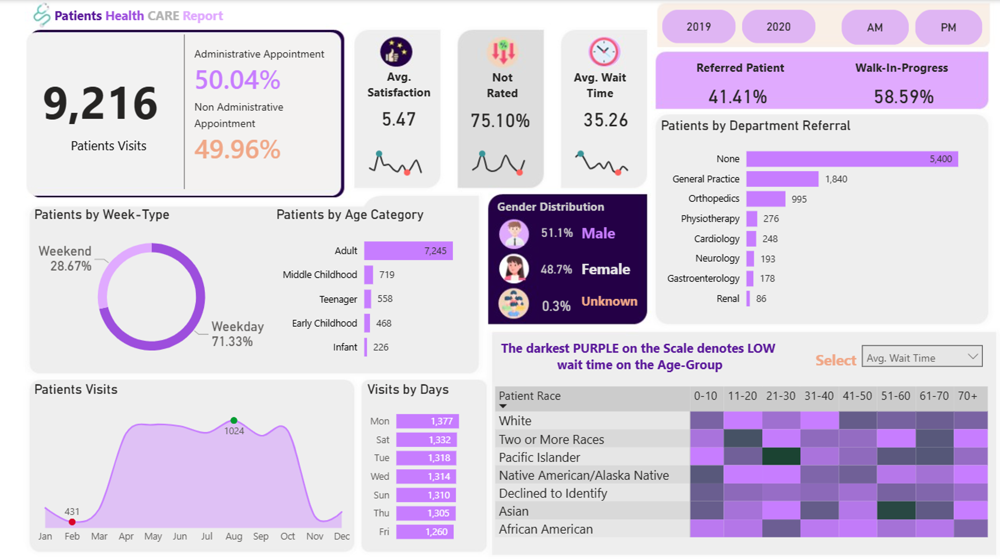

# Patients Health Care Report Dashboard

## Project Overview

This project presents a comprehensive **Patient Health Care Analytics Dashboard** developed to monitor patient visits, appointment types, demographics, referrals, wait times, satisfaction levels, and operational performance metrics.

The dashboard enables healthcare administrators and decision-makers to identify patient trends, optimize resource allocation, improve patient experience, and support data-driven healthcare management.

---

## Dashboard Snapshot

### 🔹 Overview Dashboard

```

---

# Business Objective

The primary objective of this dashboard is to:

- Monitor patient visit volumes.
- Analyze patient demographics.
- Evaluate operational efficiency.
- Track patient satisfaction.
- Measure average waiting times.
- Understand referral patterns.
- Support healthcare service optimization.

---

# Key Performance Indicators (KPIs)

| KPI | Value |
|------|--------|
| Total Patient Visits | 9,216 |
| Administrative Appointments | 50.04% |
| Non-Administrative Appointments | 49.96% |
| Average Satisfaction Score | 5.47 |
| Average Wait Time | 35.26 Minutes |
| Patients Not Rated | 75.10% |
| Walk-In Patients | 58.59% |
| Referred Patients | 41.41% |

---

# Key Business Insights

## 1. Strong Patient Volume

The healthcare facility recorded **9,216 patient visits**, demonstrating healthy patient engagement and service utilization.

### Insight
A consistently high patient volume indicates strong community trust and demand for healthcare services.

### Business Impact
- Stable healthcare utilization.
- Increased operational workload.
- Sustained revenue opportunities.

---

## 2. Adults Represent the Largest Patient Segment

### Age Distribution

| Age Category | Visits |
|-------------|---------|
| Adult | 7,245 |
| Middle Childhood | 719 |
| Teenager | 558 |
| Early Childhood | 468 |
| Infant | 226 |

### Insight

Approximately **79% of all visits originate from adult patients**, making them the primary healthcare consumer group.

### Recommendation

Focus healthcare programs on:

- Preventive healthcare
- Chronic disease management
- Adult wellness programs
- Routine health screening

---

## 3. Walk-In Patients Drive Most Visits

| Type | Percentage |
|--------|-----------|
| Walk-In | 58.59% |
| Referred | 41.41% |

### Insight

The majority of patients enter the healthcare system through direct visits rather than referrals.

### Recommendation

Strengthen referral partnerships with:

- Clinics
- Physicians
- Community healthcare centers

---

## 4. Patient Satisfaction Requires Improvement

### Average Satisfaction Score

**5.47 / 10**

### Additional Finding

**75.10% of patients did not provide feedback.**

### Business Concern

The low participation rate makes it difficult to accurately evaluate patient experiences.

### Recommendation

Implement:

- Digital feedback forms
- SMS surveys
- QR-code satisfaction surveys
- Automated post-visit feedback collection

---

## 5. Average Waiting Time is High

### Average Wait Time

**35.26 Minutes**

### Insight

Patients spend over half an hour waiting before receiving services.

### Business Impact

Long wait times may contribute to:

- Lower patient satisfaction
- Service complaints
- Reduced patient retention

### Recommendation

- Improve scheduling processes
- Optimize staff allocation
- Introduce queue management systems

---

# Operational Insights

## Weekday Demand Dominates

| Period | Percentage |
|----------|-----------|
| Weekday | 71.33% |
| Weekend | 28.67% |

### Insight

Most healthcare visits occur during weekdays.

### Recommendation

Increase staffing levels during weekday operations to reduce service bottlenecks.

---

## Monday Experiences Highest Traffic

### Visits by Day

| Day | Visits |
|------|--------|
| Monday | 1,377 |
| Saturday | 1,332 |
| Tuesday | 1,318 |
| Wednesday | 1,314 |
| Sunday | 1,310 |
| Thursday | 1,305 |
| Friday | 1,260 |

### Insight

Monday is the busiest day of the week.

### Recommendation

Allocate additional:

- Physicians
- Nurses
- Administrative staff

during peak Monday operations.

---

# Demographic Insights

## Gender Distribution

| Gender | Percentage |
|---------|-----------|
| Male | 51.1% |
| Female | 48.7% |
| Unknown | 0.3% |

### Insight

Patient visits are evenly distributed across genders.

### Recommendation

Maintain balanced healthcare services and awareness campaigns targeting both male and female populations.

---

# Referral Analysis

## Department Referrals

| Department | Patients |
|------------|----------|
| None | 5,400 |
| General Practice | 1,840 |
| Orthopedics | 995 |
| Physiotherapy | 276 |
| Cardiology | 248 |
| Neurology | 193 |
| Gastroenterology | 178 |
| Renal | 86 |

### Insight

Most patients enter the healthcare system without departmental referrals.

### Recommendation

Improve:

- Internal referral workflows
- Cross-department collaboration
- Specialist referral awareness

---

# Patient Visit Trends

## Seasonal Visit Patterns

### Observation

Patient visits increase significantly between **April and October**, reaching their highest levels around **August**.

### Lowest Activity

February recorded the lowest patient activity.

### Recommendation

Use seasonal trends for:

- Workforce planning
- Resource allocation
- Leave scheduling
- Inventory forecasting

---

# Race & Age Group Analysis

The dashboard heatmap highlights variations in average wait times across different race and age categories.

### Insight

Certain demographic groups may experience longer waiting times than others.

### Recommendation

Perform deeper investigations into:

- Scheduling efficiency
- Service accessibility
- Department workloads
- Healthcare equity indicators

to ensure fair and consistent patient experiences.

---

# Strategic Recommendations

## Short-Term Actions

- Reduce average wait time below 30 minutes.
- Increase patient feedback participation.
- Improve staffing on high-volume days.
- Implement appointment reminders.

---

## Medium-Term Actions

- Strengthen referral partnerships.
- Expand adult healthcare programs.
- Improve resource planning using visit trends.
- Establish departmental performance KPIs.

---

## Long-Term Actions

- Implement predictive healthcare analytics.
- Introduce AI-assisted scheduling.
- Develop patient retention initiatives.
- Build patient experience monitoring systems.

---

# Expected Business Benefits

Implementing these recommendations can help achieve:

- Improved patient satisfaction
- Reduced waiting times
- Better healthcare service quality
- Increased operational efficiency
- Enhanced patient retention
- Improved healthcare accessibility
- Data-driven decision-making

---

# Tools Used

- Power BI
- DAX
- Data Modeling
- Healthcare Analytics
- Data Visualization
- Business Intelligence

---

# Skills Demonstrated

- Healthcare Analytics
- Dashboard Design
- KPI Development
- Business Intelligence Reporting
- Data Storytelling
- Operational Analysis
- Strategic Recommendations
- Data-Driven Decision Making

---

# Conclusion

The Patient Health Care Dashboard reveals a healthcare facility with strong patient demand and balanced demographic coverage. However, opportunities exist to improve patient satisfaction, reduce waiting times, increase feedback participation, and strengthen referral networks.

By leveraging the insights generated from this dashboard, healthcare administrators can make informed decisions that enhance patient outcomes, optimize operations, and improve overall service quality.

---

**Author:** Joshua Paul  
**Role:** Data Analyst | Business Intelligence Analyst  
**Tools:** Power BI, SQL, Excel, DAX
